  

 

# Hi there 👋 I'm Yasin

Software Engineering student at Konya Technical University, building a foundation in software and moving toward offensive security.

I come from the engineering side — I like understanding how things work underneath and building real tools — and I'm now channeling that into security: web application pentesting, vulnerability research, and the fundamentals behind them.

### 🎯 What I'm focused on

- 🛠️ Writing practical tools in C and Python
- 🔐 Going deep into offensive security — web app pentesting & vulnerability research
- 📚 Working through HTB Academy job-role paths: Penetration Tester and AI Red Teamer
- 🧩 Sharpening fundamentals: algorithms, data structures, Linux, and networking

### 🧰 Tech & Tools

**Languages** — C · Python
**Security & Environment** — Burp Suite · Linux / Kali · HTB · PortSwigger Web Security Academy
**Dev** — Git · CLI · VS Code

### 🚀 Featured Projects

- 🔑 **[passwordingding](https://github.com/ysn-cmd/undodecider)** — A secure password generator written in C, built on cryptographically secure randomness. A small project with a security-first mindset — getting the randomness right instead of just "random enough."
- ⚡ **[Shutdownir](https://github.com/ysn-cmd/Shutdownir)** — A utility that monitors Steam downloads and automatically shuts down the system once they finish. Practical automation that solves a real annoyance.
- 🧭 **[meridien](https://github.com/ysn-cmd/meridien)** — Plugin-based security scanning and reporting platform that orchestrates recon, DAST and SAST tools into a unified findings schema.

📌 Pinned on my profile.

### 🌱 Currently working toward

**OSCP+**

### 🤝 Connect

⭐ Always learning, always building.
